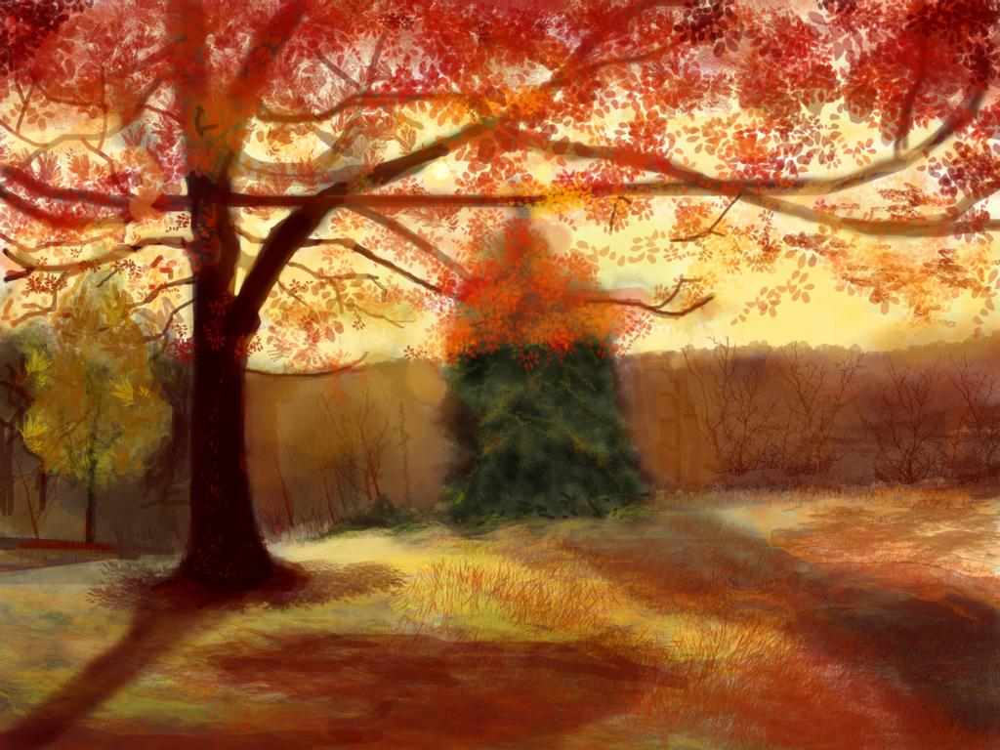

This digital painting is ony my first original artworks. I made this when I was back home in India. While I lived in Mumbai a sight like this would be unusual, because we simply don't have enough trees int he city. However when I first moved to Eugene and experienced the Autumn season it was surreal. One moment you have trees full of red leaves and the next thing you know the whole ground is covered by leaves.

Anyways back to the painting, I made this one in Adobe Photoshop with a mouse instead of a graphic tablet. I used soft brush as well as custom leaves brush. A quick search of Autumn on the inteweb gave me the necessary inspiration and reference. FYI, there was suppose to be a bench in front of the tree however after various itertions I simply didn't like it. Finally, I love the way the ground looks, it looks like it was painted in the 1800.
