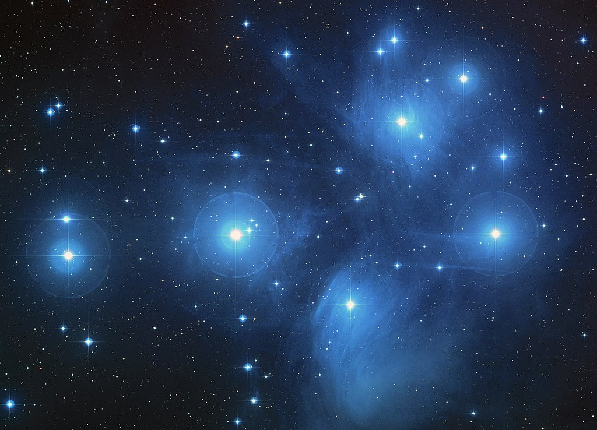

The Pleiades star cluster, also known as the Seven Sisters and Messier 45, is a conspicuous object in the night sky with a prominent place in ancient mythology.
For ages, the Pleiades have been used as an eye test for people all over the world. If you could see at least six of them, you were considered normal.
In Greek mythology, the Pleiads were the seven daughters of Atlas,
After Atlas was forced to carry the heavens on his shoulders, Orion began to pursue all of the Pleiades, and Zeus transformed them first into doves, and then into stars to comfort their father. The constellation of Orion is said to still pursue them across the night sky.

Another myths involving the Pleiades is that all seven sisters committed suicide because they were saddened by either the fate of their father, Atlas, or the loss of their siblings, the Hyades. In turn Zeus, the ruler of the Greek gods, immortalized the sisters by placing them in the sky. There these seven stars formed the star cluster known thereafter as the Pleiades.The loss of one of the sisters, Merope, in some myths may reflect an astronomical event wherein one of the stars in the Pleiades star cluster disappeared from view by the naked eye.

My favorite version of this story is similar to the  Greek one; however, this one is narrated by the Kiowa tribe in North America. It goes as follows. Long, long ago, some young women snuck away from their campsite to dance freely beneath the stars. Suddenly a bear appeared out of the bushes and started chasing them.

The sisters climbed a rock; however, the rock wasn't tall enough, and the bear started climbing it. The sisters begged the rock to save them, and it grew higher and higher until they were pushed up into the sky. The seven girls became the Pleiades, and the grooves on Devils Tower are the marks of the bear's claws.

