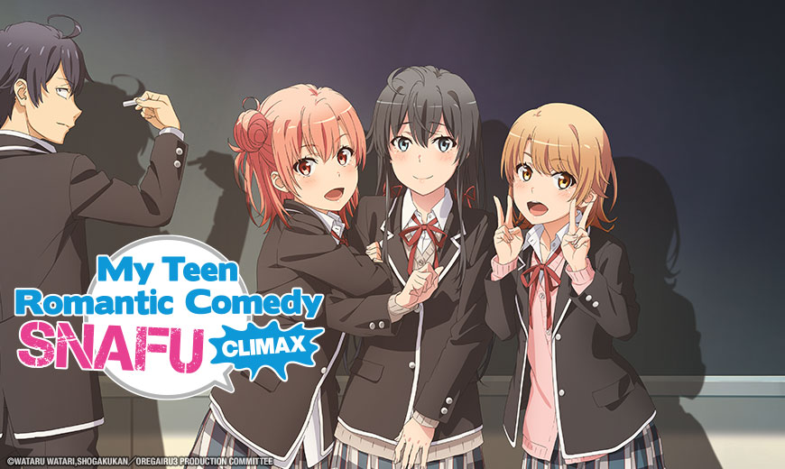

My Youth Romantic Comedy Is Wrong, As I Expected or more commonly known as Oregairu is a Japanese Light novel that has been adapted to manga and anime. It is my favorite anime of all time and so I decided to write a little review. 

Hachiman Hikigaya is an apathetic high school student with narcissistic and semi-nihilistic tendencies. He firmly believes that joyful youth is nothing but a farce, and everyone who says otherwise is just lying to themselves.
In a novel punishment for writing an essay mocking modern social relationships, Hachiman's teacher forces him to join the Volunteer Service Club, a club that aims to extend a helping hand to any student who seeks their support in achieving their goals. With the only other club member being the beautiful ice queen Yukino Yukinoshita, Hachiman finds himself on the front line of other people's problems—a place he never dreamed he would be.

The story is mostly of the 'slice-of-life' genre. It progresses at an enjoyable, yet understandable, pace. What interested me most about the storyline was that it was not clichéd in anyway. It was an original and innovative personality blended into the main protagonist and not once did that intimate personality cease to entertain.

Hachiman is full of pragmatism and with, his opinion of the world is quite less low, to say the least, and his lack of social interactions with others stem from his low perception of life and people in general. My favorite thing about him is his ability to justify his views, however warped they may seem to other. He has his reasons for being the way he is. 

Yukino Yukinoshita on the other hand, is so "perfect" (rich, beautiful, smart) that she seems so different in comparison, yet they both share the fact that they are both alone, in this case people are turned away by her sort of untouchable aura. The two have different perceptions of life, and their banter between one another is a huge strength of the series. 

The last main character is Yui Yuigahama (btw this series has many names that seem to have similar first/last names for whatever reason), a happy, cheerful girl who is the first to get help from the club. While her personality isn't as deeply developed as the aforementioned two, she rounds out the two and acts as a bond between all of them. Her personality growth is also well done.

Overall, I thought this was a very enjoyable slice of life. I really loved the main characters' personalities and their interaction with each other were smooth and well done. I thoroughly enjoyed this series and would highly recommend it to others.